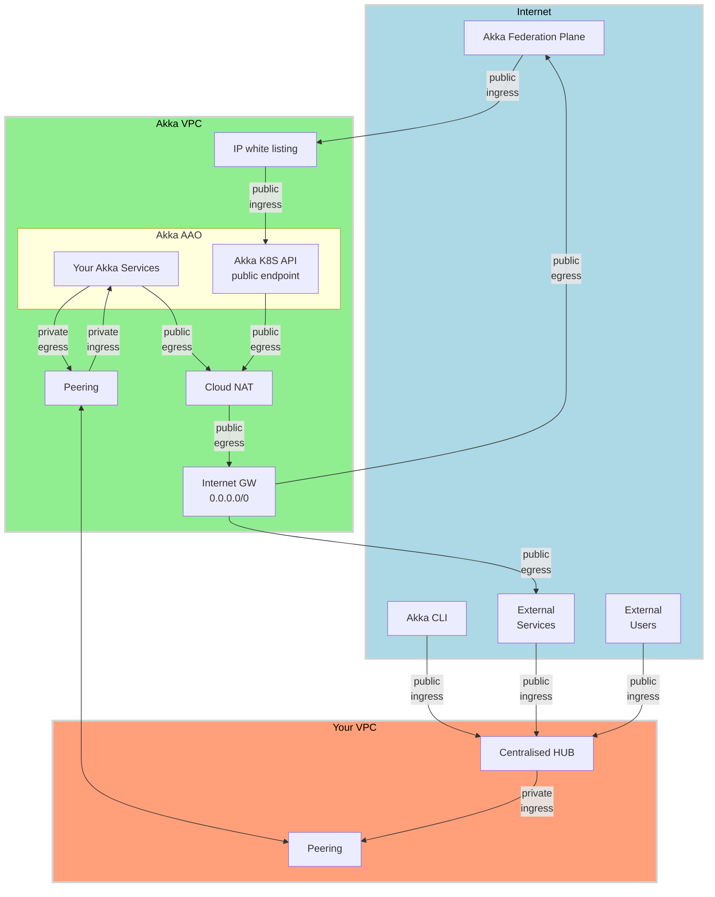
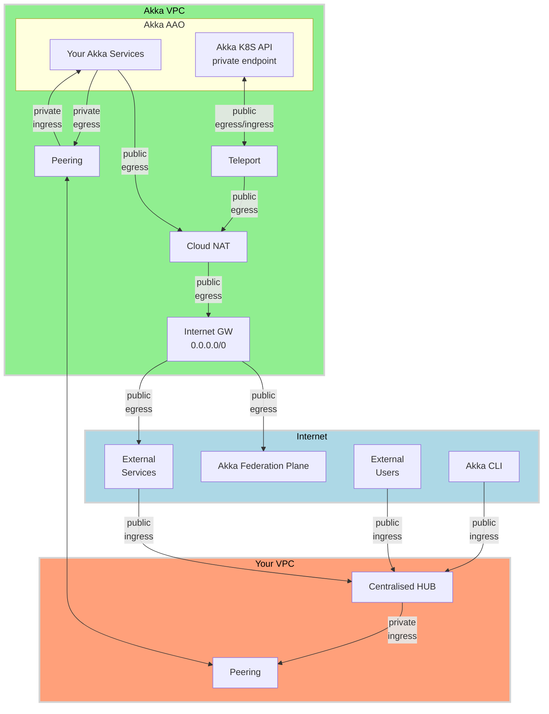
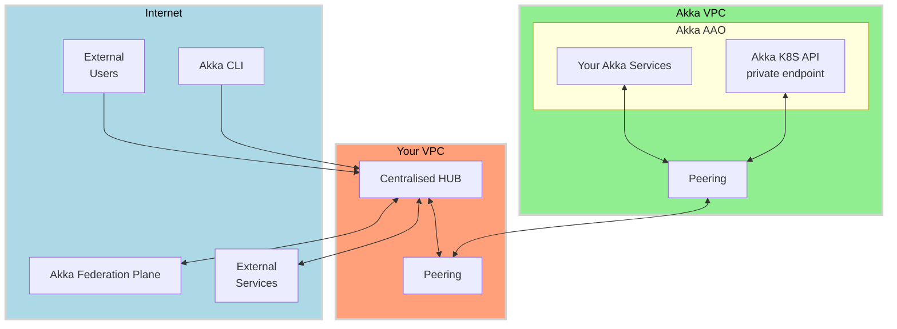

# Option 1 - Cloud NAT based egress, Akka's K8S API access (for Akka's federation plane) via public ingress with IP whitelisting

- Akka VPC `public egress` via Cloud NAT and Internet GW
  - Your Akka Services and Akka's K8S API egress to Akka's federation plane
- Akka VPC `public ingress`
  - Akka's federation plane to Akka's K8S API with public endpoint and IP whitelisting
- Your VPC Centralised HUB based `public ingress`
  - Akka CLI, External Users and Services
- Akka VPC `private egress` to Your VPC via peering
  - to internal services
- Akka VPC `private ingress` from Your VPC via peering
  - from internal services/users

# Option 2 - Cloud NAT based egress, NO Akka VPC public ingress 

- Akka VPC `public egress` via Cloud NAT and Internet GW
  - Your Akka Services and Teleport gateway for Akka's K8S API (reverse tunneling)
- **NO** Akka VPC `public ingress`
- Your VPC Centralised HUB based `public ingress`
  - Akka CLI, External Users and Services
- Akka VPC `private egress` to Your VPC via peering
  - to internal services
- Akka VPC `private ingress` from Your VPC via peering
  - from internal services/users

# Option 3 - No Public egress or ingress

- Akka VPC `public egress` via Your VPC Centralised HUB and peering
- Akka VPC `public ingress`
    - External Users and Services via Your VPC Centralised HUB and peering
- Akka VPC `private egress` to Your VPC via peering
- Akka VPC `private ingress` from Your VPC via peering

- **NO** Akka VPC `public egress`
- **NO** Akka VPC `public ingress`
- Your VPC Centralised HUB based `public ingress`
  - Akka CLI, External Users and Services, Akka's Federation Plane
- Akka VPC `private egress` to Your VPC via peering
  - to internal services, internet and Akka's Federation Plane
- Akka VPC `private ingress` from Your VPC via peering
  - from internal services/users and Akka's Federation Plane

