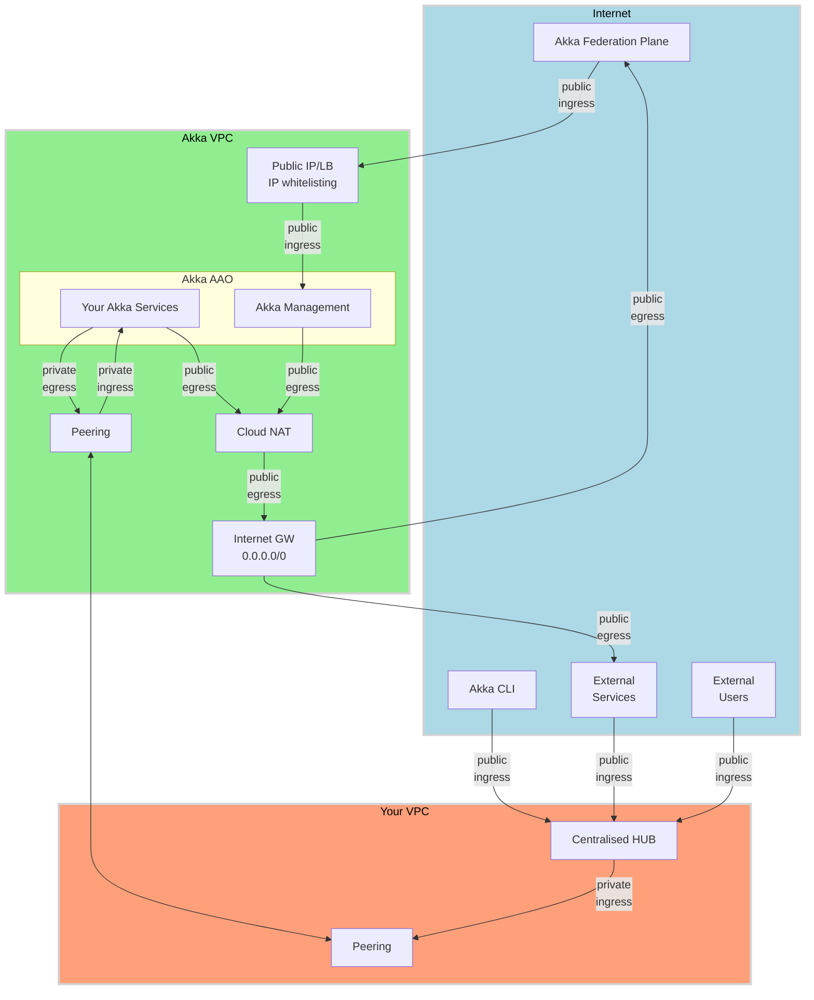
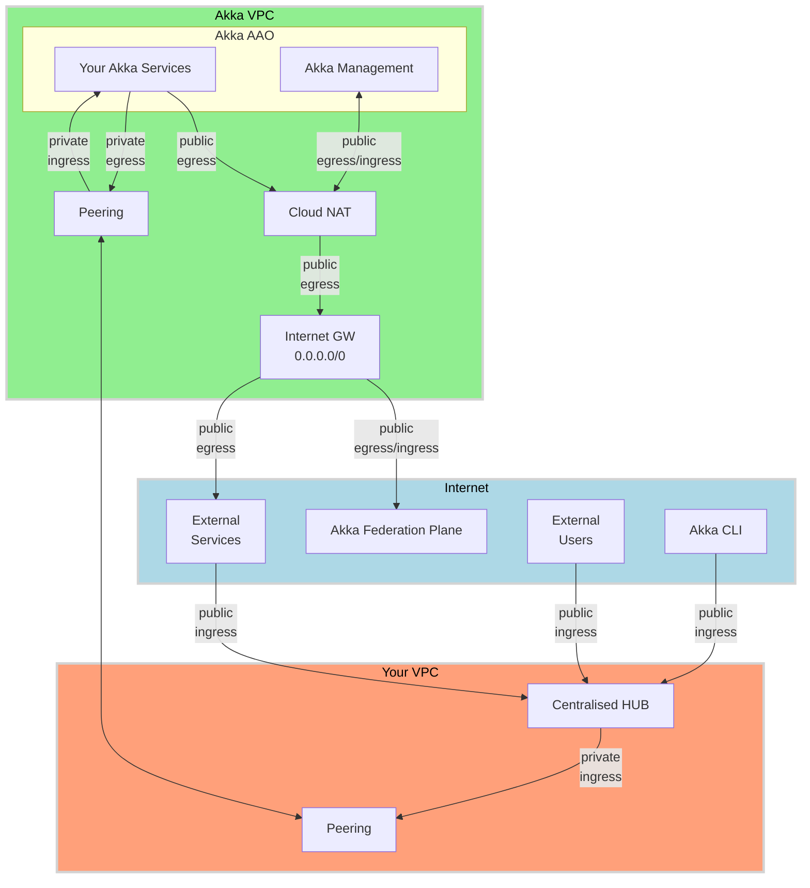
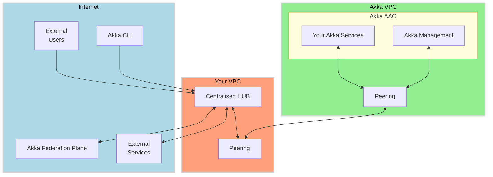

# Option 1 - Cloud NAT based egress, Akka Management access via public ingress with IP whitelisting

- Akka VPC `public egress` via Cloud NAT and Internet GW
  - Your Akka Services
  - Akka Management egress to Akka federation plane
- Akka VPC `public ingress`
  - Akka federation plane to Akka Management via public endpoint and IP whitelisting
- Your VPC Centralised HUB based `public ingress`
  - Akka CLI, External Users and Services
- Akka VPC `private egress` to Your VPC via peering
  - to internal services
- Akka VPC `private ingress` from Your VPC via peering
  - from internal services/users

# Option 2 - Cloud NAT based egress, NO Akka VPC public ingress 

- Akka VPC `public egress` via Cloud NAT and Internet GW
  - Your Akka Services and Akka Management with reverse tunneling
- **NO** Akka VPC `public ingress`
- Your VPC Centralised HUB based `public ingress`
  - Akka CLI, External Users and Services
- Akka VPC `private egress` to Your VPC via peering
  - to internal services
- Akka VPC `private ingress` from Your VPC via peering
  - from internal services/users

# Option 3 - No Public egress or ingress

- **NO** Akka VPC `public egress`
- **NO** Akka VPC `public ingress`
- Your VPC Centralised HUB based `public ingress`
  - Akka CLI, External Users and Services, Akka federation plane
- Akka VPC `private egress` to Your VPC via peering
  - to internal services, internet and Akka federation plane
- Akka VPC `private ingress` from Your VPC via peering
  - from internal services/users and Akka federation plane

